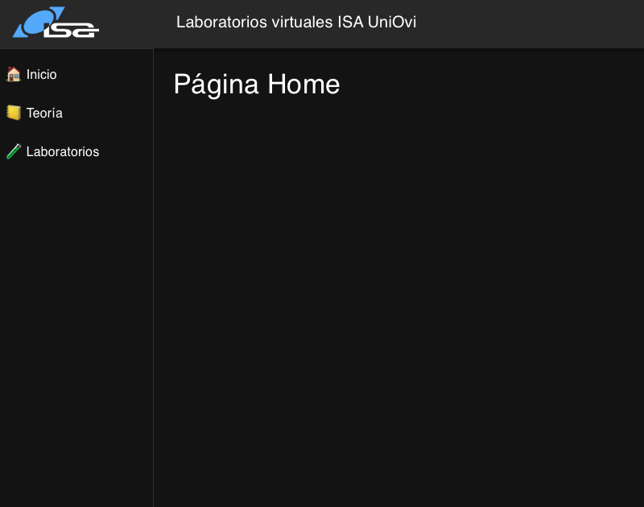

# React 

El frontend react proporciona las siguientes funcionalidades:

- Contenido modular.
- Gran comunidad y frameworks.
- Permite integrar contenido usando markdown.
- Componentes para mostrar información en tiempo real. Charts.js, websockets.
- Integración con FastAPI.


## Configuración

Para el desarrollo de la aplicación de react, su compilación y su despligue es recomendable un entorno de desarrollo. En este caso se ha seleccionado [Vite](https://vite.dev) como entorno de desarrollo.


Para iniciar el entorno de desarrollo y crear el esqueleto de la página:

``` bashrc
npm create vite@latest my-app -- --template react
```

El framework de desarrollo te crea un directorio de trabajo. Con npm tenemos que instalar las dependencias del paquete. El gestor de paquetes npm lee el archivo packages.json e instala todas las dependencias. 


```bashrc
cd my-frontend
npm install
```
Una vez instaladas las dependencias se puede ejecutar la aplicación con el servidor de desarrollo:

```bashrc
npm run dev
```

Para muchos de los elementos gráficos que se utilizan en la página se emplea MUI. Se instala varios paquetes de MUI con npm:

```bashrc
 npm install @mui/material @emotion/react @emotion/styled react-router-dom @mui/joy/styles  @mui/icons-material
```

## Estructura inicial del frontend

La plantilla que se desarrolla de ejemplo se divide en un menú reactivo y una serie de páginas con contenido. El menú se desarrolla haciendo uso de MUI y del componente drawer. El componente drawer es el siguiente 

```jsx

import * as React from 'react';
import AppBar from '@mui/material/AppBar';
import Box from '@mui/material/Box';
import CssBaseline from '@mui/material/CssBaseline';
import Divider from '@mui/material/Divider';
import Drawer from '@mui/material/Drawer';
import IconButton from '@mui/material/IconButton';
import List from '@mui/material/List';
import ListItem from '@mui/material/ListItem';
import ListItemButton from '@mui/material/ListItemButton';
import ListItemText from '@mui/material/ListItemText';
import MenuIcon from '@mui/icons-material/Menu';
import Toolbar from '@mui/material/Toolbar';
import Typography from '@mui/material/Typography';


import { useNavigate, Outlet } from 'react-router-dom';
import Logo from './assets/logo.png'; // Ajusta la ruta


const drawerWidth = 200;

export default function ResponsiveDrawer(props) {
  const { window } = props;
  const [mobileOpen, setMobileOpen] = React.useState(false);
  const [isClosing, setIsClosing] = React.useState(false);

  const navigate = useNavigate();

    const menuItems = [
        { text: '🏠 Inicio', path: '/' },
        { text: '📒 Teoría', path: '/teoria' },
        { text: '🧪 Laboratorios', path: '/laboratorios' },
        
  ];

  const handleDrawerClose = () => {
    setIsClosing(true);
    setMobileOpen(false);
  };

  const handleDrawerTransitionEnd = () => {
    setIsClosing(false);
  };

  const handleDrawerToggle = () => {
    if (!isClosing) {
      setMobileOpen(!mobileOpen);
    }
  };
    


  const drawer = (
    <div>
      
      <Divider />
      <List>
        {menuItems.map((item) => (
          <ListItem key={item.text} disablePadding>
            <ListItemButton
              onClick={() => {
                navigate(item.path);
                // handleDrawerClose(); // cierra en mobile
              }}
            >
              <ListItemText primary={item.text} />
            </ListItemButton>
          </ListItem>
        ))}
      </List>
    </div>
  );

  const container = window !== undefined ? () => window().document.body : undefined;

    return <Box sx={{ display: 'flex' }}>
            <CssBaseline />
            <AppBar position="fixed">
                <Toolbar>
                    <IconButton
                        color="inherit"
                        aria-label="open drawer"
                        edge="start"
                        onClick={handleDrawerToggle}
                        sx={{ mr: 2, display: { sm: 'none' } }}
                    >
                        <MenuIcon />
                </IconButton>
                
                <Box
                    component="img"
                    src={Logo}
                    alt="Logo ISA"
                    sx={{
                        height: 40,  // ajusta tamaño
                        mr: 2,       // margen a la derecha del logo
                    }}
                />
                <Typography variant="h6" noWrap component="div" sx={{ ml: 10}}>
                        Laboratorios virtuales ISA UniOvi
                    </Typography>
                </Toolbar>
            </AppBar>
            <Box
                component="nav"
                sx={{ width: { sm: drawerWidth }, flexShrink: { sm: 0 } }}
                aria-label="mailbox folders"
            >
                <Drawer
                    container={container}
                    variant="temporary"
                    open={mobileOpen}
                    onTransitionEnd={handleDrawerTransitionEnd}
                    onClose={handleDrawerToggle}
                    sx={{
                        display: { xs: 'block', sm: 'none' },
                        '& .MuiDrawer-paper': { boxSizing: 'border-box', width: drawerWidth },
                    }}
                    slotProps={{
                        root: {
                            keepMounted: true,
                        },
                    }}
                >
                    {drawer}
                </Drawer>
                <Drawer
                variant="permanent"
                sx={{
                    display: { xs: 'none', sm: 'block' },
                    '& .MuiDrawer-paper': {
                        boxSizing: 'border-box',
                        width: drawerWidth,
                        top: '64px',
                        height: 'calc(100% - 64px)',
                    },
                }}
                open={true}
                >
                    {drawer}
                </Drawer>
            </Box>

            <Box
                component="main"
                sx={{
                    flexGrow: 1,
                    p: 3,
                    width: { sm: `calc(100% - ${drawerWidth}px)` },
                }}
            >
                <Outlet />
            </Box>

        </Box> 

   
  
}


```
Consta de una barra de aplicación superior y de un menú lateral, tal y como se muestra en la siguiente imagen:



Este archivo crea el ```<box>``` principal donde se renderizará todo el contenido principal de todas las páginas, gracias al componente ```<Outlet>```.


Para renderizar las diferentes páginas en el espacio ```<Outlet>``` se hace uso del paquete navigate y routes. Dentro del archivo app.jsx se controla la navegación entre páginas:

```jsx
import { Routes, Route } from 'react-router-dom'
import ResponsiveDrawer from './ResponsiveDrawer'
import Teoria from './pages/Teoria'
import Laboratorios from './pages/Laboratorios'
import Home from "./pages/Home"

export default function App() {
  return (
    
    <Routes>
      <Route path="/" element={<ResponsiveDrawer />} >
        <Route index element={<Home />} />
        <Route path="teoria" element={<Teoria />} />
        <Route path="laboratorios" element={<Laboratorios />} />
      </Route>
    </Routes>
        
    
  );
}

```

Es un enrutado jerarquico donde la ruta padre renderiza el menú con el ```<Outlet \>``` y las rutas hijas renderizan las distintas páginas.

## ¿Cómo crear una nueva página?

1. Añadir un nuevo item al menú, modificando el componente ```menuConfig.jsx```:
```jsx
    const menuItems = [
        { text: '🏠 Inicio', path: '/' },
        { text: '📒 Teoría', path: '/teoria' },
        { text: '🧪 Laboratorios', path: '/laboratorios' },];
```

2. Modificar el enrutado en ```app.jsx```:
```jsx
    <Routes>
      <Route path="/" element={<ResponsiveDrawer />} >
        <Route index element={<Home />} />
        <Route path="teoria" element={<Teoria />} />
        <Route path="laboratorios" element={<Laboratorios />} />
      </Route>
    </Routes>
```
3. Crear un archivo jsx para esa página y guardarlo en la ruta ``` ./pages/```


## Renderizado de Markdown

Para facilitar la creación de contenido se explora el uso del leguaje Markdown para generar nuevas páginas. Se instala el paquete:

```bashrc
npm install react-markdown
npm i -S remark-math rehype-katex
```

Las páginas de markdown se editarán y guardarán dentro de la carpeta ```\public```.

Para renderizar las páginas en markdown se leerán los archivos ```.md``` de la carpeta public de la siguiente manera:
```jsx
    const [markdownContent, setMarkdownContent] = useState("");

    useEffect(() => {
      fetch("/pageInMarkdown.md")
        .then((response) => response.text())
        .then((text) => setMarkdownContent(text));
    }, []);

``` 

Para renderizar la página se emplea el componente ```ReactMarkdown``` modificado para dar soporte a las fórmulas y el código de las páginas de markdown:

```jsx

      <ReactMarkdown
            remarkPlugins={[ remarkMath ]}
            rehypePlugins={[ rehypeKatex ]}
                  components={{
                    code({ className, children, ...rest }) {
                      const match = /language-(\w+)/.exec(className || "");
                      return match ? (
                        <SyntaxHighlighter
                          PreTag="div"
                          language={match[1]}
                          style={dark}
                          {...rest}
                        >
                          {children}
                        </SyntaxHighlighter>
                      ) : (
                        <code {...rest} className={className}>
                          {children}
                        </code>
                      );
                    },
                  }}
          >{markdownContent}</ReactMarkdown>
```

El código completo del componente para el renderizado de contenido en markdown es el siguiente:
```jsx
import ReactMarkdown from "react-markdown";
import { Toolbar, Box, Container } from '@mui/material';
import { Prism as SyntaxHighlighter } from "react-syntax-highlighter";
import { dark } from "react-syntax-highlighter/dist/esm/styles/prism";
import { useEffect, useState } from "react";

import remarkMath from 'remark-math'
import rehypeKatex from 'rehype-katex'
import 'katex/dist/katex.min.css'

export default function MarkdownComponent() {

    const [markdownContent, setMarkdownContent] = useState("");

    useEffect(() => {
      fetch("/pageInMarkdown.md")
        .then((response) => response.text())
        .then((text) => setMarkdownContent(text));
    }, []);


  return (
<Container maxWidth="md">
<Box sx={{ my: 4, p: 3, color: '#fff' }}>
  
      <ReactMarkdown
            remarkPlugins={[ remarkMath ]}
            rehypePlugins={[ rehypeKatex ]}
                  components={{
                    code({ className, children, ...rest }) {
                      const match = /language-(\w+)/.exec(className || "");
                      return match ? (
                        <SyntaxHighlighter
                          PreTag="div"
                          language={match[1]}
                          style={dark}
                          {...rest}
                        >
                          {children}
                        </SyntaxHighlighter>
                      ) : (
                        <code {...rest} className={className}>
                          {children}
                        </code>
                      );
                    },
                  }}
          >{markdownContent}</ReactMarkdown>
      </Box>
      </Container>
  );
}


```


[Página principal](../../README.md)